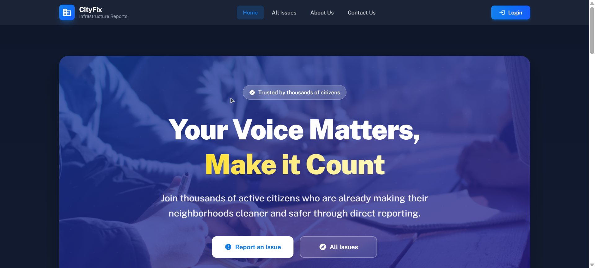

# CityFix 🏙️  
### Public Infrastructure Issue Reporting System

CityFix is a modern, responsive web platform that enables citizens to report and track public infrastructure issues such as potholes, broken streetlights, and road damage. It promotes transparency, accountability, and faster resolution through role-based workflows.

---

## 📸 Screenshot


<!-- Replace with your actual screenshot filename or image URL -->

---

## 🔗 Live Links

- 🌐 **Live Site:** https://devcat-b12a11.vercel.app  
- ⚙️ **Backend API:** https://city-fix-server.onrender.com  

---

## 🔐 Admin Access (Demo)

> For testing and evaluation purposes

- **Email:** `admin@cityfix.com`  
- **Password:** `Admin123!`

---

## ✨ Key Features

- 📝 **Infrastructure Issue Reporting**  
  Report city issues with descriptions, images, and location details.

- 👥 **Role-Based Dashboards**  
  Separate dashboards for **Citizens**, **Staff**, and **Admins**.

- ⏱️ **Real-Time Issue Tracking**  
  Visual timeline/stepper UI showing progress from *Pending → Resolved → Closed*.

- 👍 **Community Upvoting**  
  Logged-in users can upvote issues to highlight community priorities.

- 🧑‍🔧 **Staff Assignment System**  
  Admins can assign issues to specific staff members for accountability.

- 💎 **Premium Membership**  
  Premium users (৳1000) can submit unlimited reports with priority handling.

- 🚀 **Priority Boosting**  
  Users can boost an issue (৳100) to move it to the top of listings.

- 🧾 **Automated Invoice Generation**  
  Download professional PDF invoices for all payments.

- 🔍 **Advanced Search & Filters**  
  Server-side filtering by category, status, and priority with real-time search.

- 🔐 **Secure Authentication**  
  Firebase Email/Password login and Google OAuth support.

- 📱 **Responsive & Modern UI**  
  Mobile-first design using Tailwind CSS and DaisyUI.

- 🎬 **Smooth Animations**  
  Polished UI transitions and effects powered by Framer Motion.

---

## 🛠️ Tech Stack

### Frontend
- React (Vite)
- Tailwind CSS
- DaisyUI
- Framer Motion

### State Management
- TanStack Query (React Query)

### Backend & Services
- Firebase Authentication
- REST API (Node.js / Express)
- Axios with interceptors

### Payments
- Stripe Checkout
- Stripe Payment Intents

---

## 📦 Dependencies

Major dependencies used in the project:

- react
- react-router-dom
- @tanstack/react-query
- firebase
- axios
- framer-motion
- tailwindcss
- daisyui

(See `package.json` for the complete list)

---

## 🚀 Getting Started

Follow these steps to run the project locally:

```bash
# Clone the repository
git clone https://github.com/your-username/city-fix-client.git

# Navigate to the project directory
cd city-fix-client

# Install dependencies
npm install

# Start the development server
npm run dev
